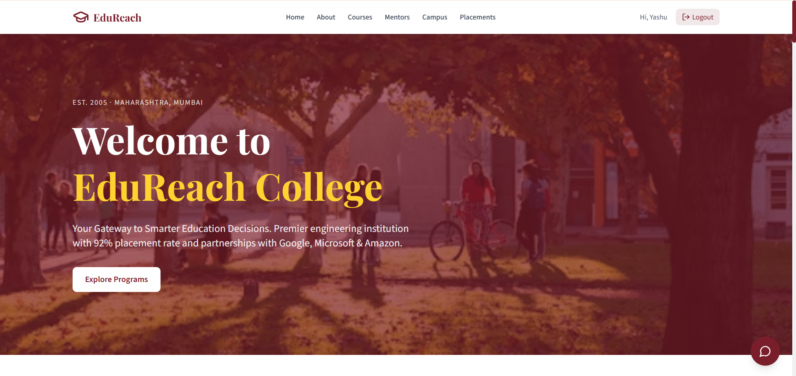
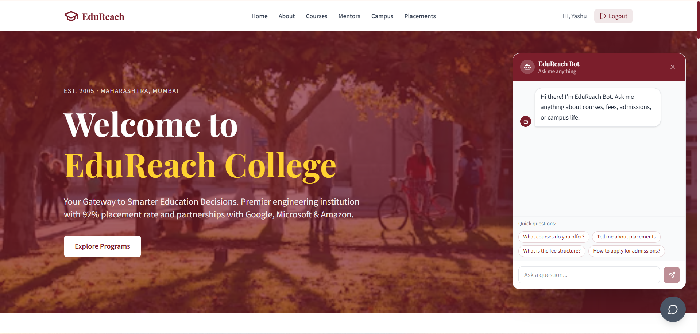
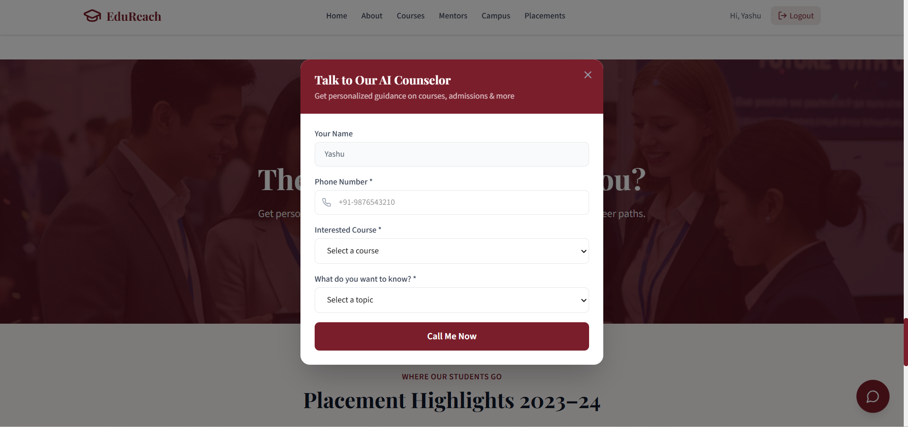

# EduReach — Agentic AI College Counseling Platform

<div align="center">


[](https://edu-reach-college.vercel.app)
[](https://edureach-server.onrender.com)
[](https://github.com/yashwanthgowda666/EduReach-College)

**An AI-powered college counseling platform combining Agentic RAG chatbot and AI voice calling**

</div>

---

## Problem Statement

Students seeking college information face a frustrating reality:

| What Students Do | The Problem |
|---|---|
| Browse college websites | Information overload, hard to find specifics |
| Call admissions office | Limited hours, long wait times |
| Visit campus in person | Time-consuming, not always possible |
| Ask friends/seniors | May not have accurate or updated info |

**EduReach solves this with a 24/7 AI counselor available via chat and real phone calls.**

---

## Live Demo

🌐 **Frontend:** [https://edu-reach-college.vercel.app](https://edu-reach-college.vercel.app)  
🔧 **Backend API:** [https://edureach-server.onrender.com](https://edureach-server.onrender.com)

### Test Credentials
```
Email: test@edureach.com
Password: 123456
```

---

## Key Features

### 🤖 Agentic RAG Chatbot
- AI agent autonomously decides when to search the knowledge base
- Google Gemini embeddings with 3072-dimensional vectors
- MongoDB Atlas Vector Search for semantic similarity matching
- Powered by LangChain ReAct agent with tool-calling

### 📞 AI Voice Counselor (Ava)
- Real outbound phone calls via Vapi AI
- Personalized greeting with student's name and course interest
- Natural voice conversation about courses, fees, admissions

### 🔐 JWT Authentication System
- Secure register/login with bcrypt password hashing
- Stateless JWT tokens with 7-day expiry
- Protected routes via Express middleware
- Auth state persistence across page refreshes

### 🎯 Gated Content System
- Visitors see homepage above Mentors section
- Logged-in users unlock Student Life, Events, Placements, Counselor
- Auto signup popup triggers at Mentors scroll position (once per session)

---

## System Architecture

```
┌─────────────────────────────────────────────┐
│           FRONTEND (React + TypeScript)      │
│                                             │
│  AuthContext → Global auth state            │
│  Axios Interceptor → Auto JWT attachment    │
│  React Router → Client-side navigation      │
│  Gated Content → Visitor vs Logged-in UI    │
└─────────────────┬───────────────────────────┘
                  │ HTTPS (Axios)
┌─────────────────▼───────────────────────────┐
│           BACKEND (Node.js + Express)        │
│                                             │
│  Auth Routes    → /api/auth                 │
│  Chat Routes    → /api/chat                 │
│  Vapi Routes    → /api/vapi                 │
│                                             │
│  Auth Middleware → JWT verification         │
│  Error Handler  → Global error handling     │
└──────┬──────────────┬────────────────────────┘
       │              │
┌──────▼──────┐  ┌────▼──────────────────────┐
│  MongoDB    │  │     External APIs          │
│  Atlas      │  │                            │
│             │  │  Google Gemini             │
│  users      │  │  → Chat + Embeddings       │
│  knowledge  │  │                            │
│  _docs      │  │  Vapi AI                   │
│  (vectors)  │  │  → Outbound phone calls    │
└─────────────┘  └───────────────────────────┘
```

---

## RAG Pipeline

```
edureach-knowledge.txt
        │
        ▼
   TextLoader          ← Reads .txt file
        │
        ▼
RecursiveCharacter     ← Splits into 1000 char chunks
  TextSplitter           with 200 char overlap
        │
        ▼
 Gemini Embeddings     ← Converts each chunk to
  (3072 dimensions)      3072-dimensional vector
        │
        ▼
MongoDB Atlas          ← Stores text + vector
 Vector Store            in knowledge_docs collection
        │
     [QUERY]
        │
        ▼
 User Question         ← Converted to vector
        │
        ▼
Cosine Similarity      ← Finds top 3 matching chunks
    Search
        │
        ▼
 Gemini LLM            ← Reads chunks + generates answer
 (ReAct Agent)
        │
        ▼
   Response
```

---

## Tech Stack

### Frontend
| Technology | Purpose |
|---|---|
| React 18 + TypeScript | UI framework with type safety |
| React Router DOM | Client-side routing |
| Axios | HTTP client with interceptors |
| Tailwind CSS v4 | Utility-first styling |
| React Hot Toast | Toast notifications |
| Lucide React | Icon library |

### Backend
| Technology | Purpose |
|---|---|
| Node.js v24 | Runtime environment |
| Express.js | Web framework |
| TypeScript | Type safety |
| Mongoose | MongoDB ODM |
| bcryptjs | Password hashing |
| jsonwebtoken | JWT auth tokens |

### AI & Database
| Technology | Purpose |
|---|---|
| Google Gemini 2.5 Flash | Chat response generation |
| Gemini Embedding 001 | Text to vector conversion |
| LangChain + LangGraph | RAG pipeline + ReAct agent |
| MongoDB Atlas | Database + Vector store |
| Vapi AI | Outbound phone call AI |

### DevOps
| Technology | Purpose |
|---|---|
| Vercel | Frontend deployment |
| Render | Backend deployment |
| GitHub | Version control |

---

## Project Structure

```
edureach-platform/
│
├── client/                          # React Frontend
│   ├── src/
│   │   ├── components/
│   │   │   ├── Navbar.tsx
│   │   │   ├── ChatDrawer.tsx       # AI chat interface
│   │   │   ├── FloatingChatButton.tsx
│   │   │   ├── CallPopup.tsx        # Voice call UI (state machine)
│   │   │   ├── SignupPopup.tsx
│   │   │   └── ...homepage sections
│   │   ├── context/
│   │   │   └── AuthContext.tsx      # Global auth state
│   │   ├── pages/
│   │   │   ├── HomePage.tsx         # Gated content logic
│   │   │   ├── LoginPage.tsx
│   │   │   └── SignupPage.tsx
│   │   ├── services/
│   │   │   ├── api.ts               # Axios instance + interceptor
│   │   │   ├── auth.service.ts
│   │   │   ├── chat.service.ts
│   │   │   └── vapi.service.ts
│   │   └── data/
│   │       └── content.ts           # All static content
│   └── vercel.json                  # SPA routing config
│
└── server/                          # Node.js Backend
    ├── knowledge-base/
    │   └── edureach-knowledge.txt   # College information
    └── src/
        ├── config/
        │   └── database.config.ts   # MongoDB connection
        ├── models/
        │   ├── user.model.ts
        │   └── knowledge-doc.model.ts
        ├── controllers/
        │   ├── auth.controller.ts
        │   ├── chat.controller.ts
        │   └── vapi.controller.ts
        ├── services/
        │   ├── rag.service.ts       # Core AI logic
        │   └── vapi.service.ts
        ├── middleware/
        │   ├── auth.middleware.ts
        │   └── error-handler.middleware.ts
        ├── routes/
        │   ├── auth.routes.ts
        │   ├── chat.routes.ts
        │   └── vapi.routes.ts
        ├── app.ts
        └── server.ts
```

---

## Getting Started

### Prerequisites
- Node.js v24+
- MongoDB Atlas account
- Google AI Studio API key
- Vapi account

### Installation

**1. Clone the repository**
```bash
git clone https://github.com/yashwanthgowda666/EduReach-College.git
cd EduReach-College
```

**2. Setup Backend**
```bash
cd server
npm install
```

Create `server/.env`:
```env
PORT=5000
NODE_ENV=development
MONGODB_URI=your_mongodb_uri
JWT_SECRET=your_jwt_secret
JWT_EXPIRES_IN=7d
CLIENT_URL=http://localhost:5173
GOOGLE_API_KEY=your_google_api_key
VAPI_API_KEY=your_vapi_api_key
VAPI_ASSISTANT_ID=your_assistant_id
VAPI_PHONE_NUMBER_ID=your_phone_number_id
```

```bash
npm run dev
```

**3. Setup Frontend**
```bash
cd client
npm install
npm run dev
```

**4. MongoDB Atlas Vector Search Index**

Create a Vector Search index on `knowledge_docs` collection:
```json
{
  "fields": [
    {
      "type": "vector",
      "path": "embedding",
      "numDimensions": 3072,
      "similarity": "cosine"
    }
  ]
}
```
Index name: `edureach_vector_index`

---

## API Reference

### Auth Endpoints
```
POST /api/auth/register   → Create account, returns JWT
POST /api/auth/login      → Login, returns JWT
GET  /api/auth/me         → Get current user (protected)
```

### Chat Endpoints
```
POST /api/chat/message    → Send message, returns AI response
Body: { "message": "What is the fee for B.Tech CSE?" }
```

### Vapi Endpoints
```
POST /api/vapi/call       → Initiate AI phone call (protected)
Body: { "phoneNumber": "9876543210", "preferredCourse": "B.Tech CSE" }
```

---

## Key Design Decisions

### Why Agentic RAG over Basic RAG?
Basic RAG always retrieves chunks regardless of the question. Agentic RAG uses a ReAct agent that **decides when to search** — more efficient, more accurate, handles conversational questions naturally.

### Why JWT over Sessions?
Frontend and backend are decoupled systems on different servers (Vercel + Render). JWT is stateless — server verifies token signature without database lookups, scales naturally across separate origins.

### Why MongoDB for Vectors?
MongoDB Atlas Vector Search allows storing both structured user data and unstructured vector embeddings in one database. Eliminates need for a separate vector database like Pinecone.

### Why Split Auth Logic Across Frontend and Backend?
- **Backend** → real security (rejects invalid tokens via middleware)
- **Frontend** → UX control (hides/shows content based on auth state)
Frontend-only auth is never real security.

---

## Screenshots

### Homepage


### AI Chat and Voice Call

| AI Chat | Voice Call |
|---|---|
|  |  |

---

## What I Learned

- Building production RAG pipelines with LangChain and vector databases
- Implementing stateless JWT authentication across decoupled systems
- Designing state machines for complex UI flows (CallPopup)
- Working with external AI APIs (Gemini, Vapi) in production
- Full deployment pipeline with Vercel + Render + MongoDB Atlas

---

## Author

**Yashwanth Gowda**  
[](https://www.linkedin.com/in/yashwanth-gowda-4912a229b/)
[](https://github.com/yashwanthgowda666)
[](mailto:gyashwanthh07@gmail.com)

---

<div align="center">
  <strong>⭐ Star this repository if you found it helpful!</strong>
</div>
